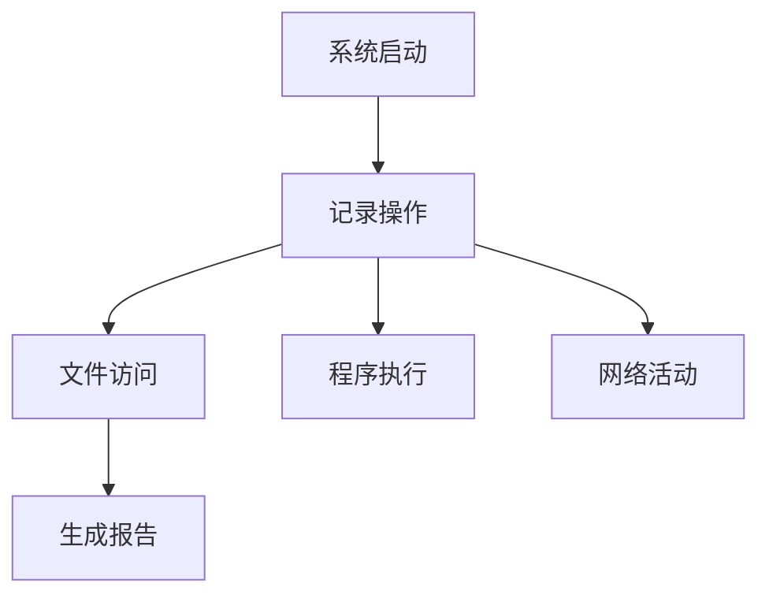

# 实用软件工具库 🧰


个人精选的实用软件集合，涵盖系统工具、磁盘管理、多媒体处理等多领域

## 📦 软件目录

### 系统工具
- **ChipGenius** - USB设备芯片检测工具
- **LastActivityView** - 系统操作记录查看器
- **Empty_folder_cleanup** - 空文件夹清理工具

### 磁盘管理
- **DiskGenius** - 专业级数据恢复与分区管理

### 多媒体
- **QianQianMusic** - 高品质音乐播放器（怀旧款）
- **Winzip** - 经典压缩工具（绿色版）

## 🛠️ 使用指南

### 快速获取
```bash
git clone https://github.com/your-username/Software_Libraries.git
cd Software_Libraries/{分支名}
```

### 分支说明
| 分支名称 | 主要功能 |
|---------|---------|
| ChipGenius | USB设备芯片信息检测 |
| DiskGenius | 磁盘分区/数据恢复 |
| Empty_folder_cleanup | 智能清理空文件夹 |
| LastActivityView | 系统活动审计 |
| QianQianMusic | 千千音乐下载 |
| Winzip | 绿色版压缩工具 |

## ⚙️ 配置要求
- Windows 7/10/11 系统
- .NET Framework 4.5+（部分工具需要）
- 管理员权限（磁盘工具需要）

## 📥 下载方式
1. 通过Git克隆特定分支：
   ```bash
   git clone -b DiskGenius --single-branch https://github.com/your-username/Software_Libraries.git
   ```
2. 或直接下载[Release版本](https://github.com/your-username/Software_Libraries/releases)

## 🚀 特色工具推荐

### LastActivityView


### Empty_folder_cleanup
- 递归扫描指定目录
- 智能识别无效空文件夹
- 支持白名单配置
- 删除前自动备份


**收录标准**：
- 免费/开源软件优先
- 提供绿色免安装版
- 有明确的使用文档
- 无恶意软件行为

## 📄 许可声明
各软件遵守其原作者的许可协议，本仓库仅作收集整理

---

💡 使用提示：
- 部分安全软件可能误报，请添加信任
- 建议在虚拟机中测试未知工具
- 定期检查更新分支

⭐ 如果喜欢这个资源库，欢迎Star支持！
